<!-- ======================= PROFILE HEADER ======================= -->

  

  
  
  

---

## 👨‍💻 About Me

- 🎓 Computer Science Engineering student, building a strong foundation in **Java, Data Structures & Algorithms**.
- 🛠️ I like turning real problems into working software — from **management systems** to **algorithm implementations**.
- 🏆 Active **hackathon participant** — I enjoy collaborating and building under a deadline.
- 🌱 On the side, exploring the basics of **Linux & DevOps**, one concept at a time.
- 📫 How to reach me: **singhadarsh42003@gmail.com**

---

## 🧰 Tech Stack

---

## 🚀 Projects

> 🚧 **Building in public** — my projects will be featured here soon. Watch this space!

<!--
| Project | Description | Tech |
| :--- | :--- | :--- |
| 💰 [Personal Finance Manager](https://github.com/adarshsinghhh004/Personal-Finance-Manager-Java) | Desktop app to track personal finances & daily expenses | Java · Swing |
| ⌨️ [Typing Speed Racer](https://github.com/adarshsinghhh004/TypingSpeedRacer) | A game to test and improve your typing speed | Java |
| 🎟️ [Event Platform — Frontend](https://github.com/adarshsinghhh004/aduberg-event-frontend) | Frontend for a college event management platform | TypeScript |
-->

---

## 📊 GitHub Stats

  
  

---

## 🐍 Contribution Snake

  

---

## 🌱 What I'm Learning Next

Currently strengthening my **DSA** and getting hands-on with the fundamentals of **Linux, Git & DevOps** — step by step.

  

<!-- ======================= FOOTER ======================= -->

  

